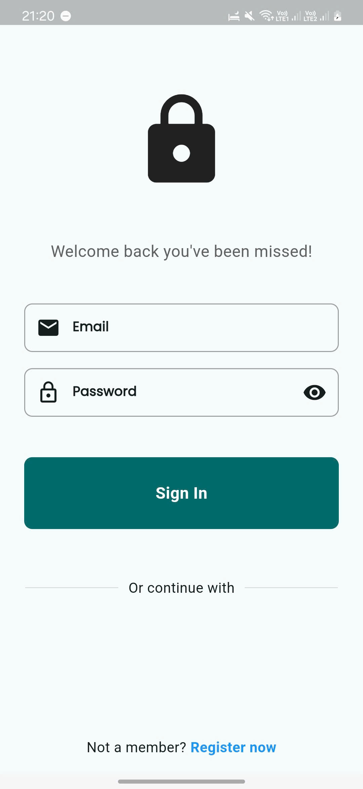
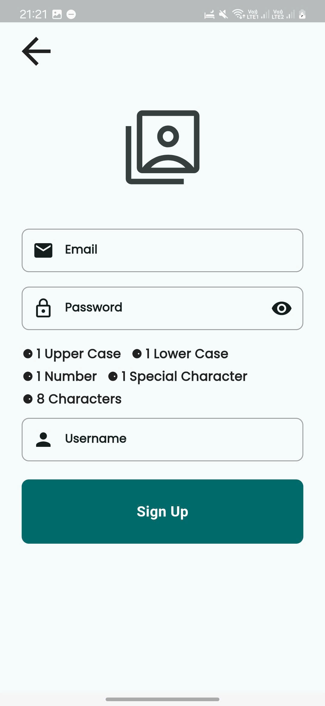
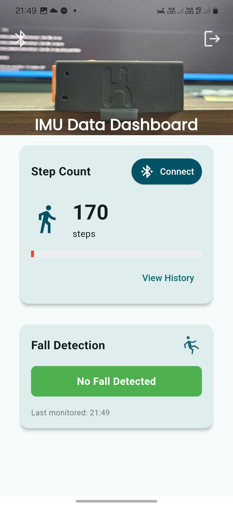
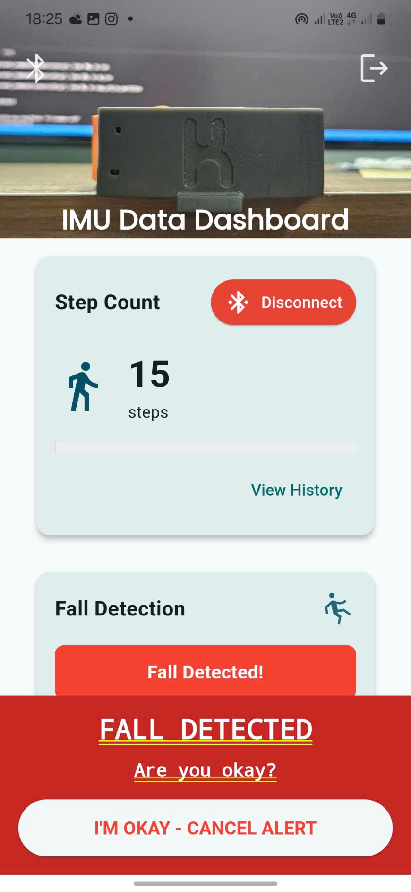
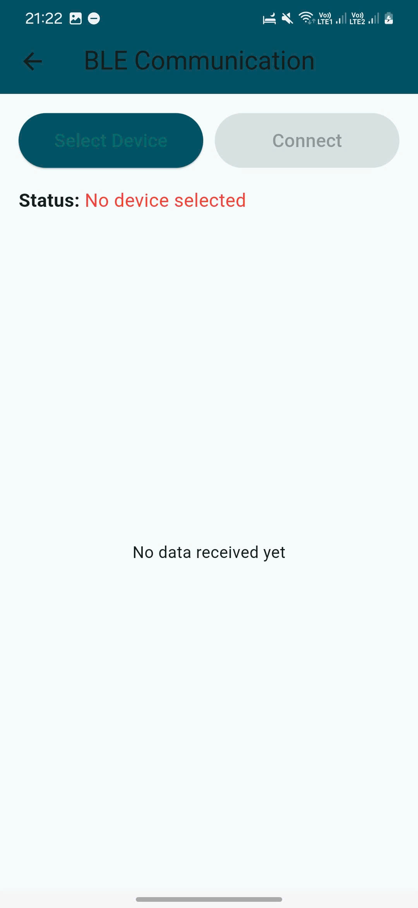
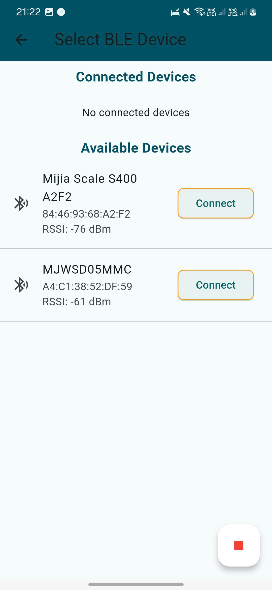
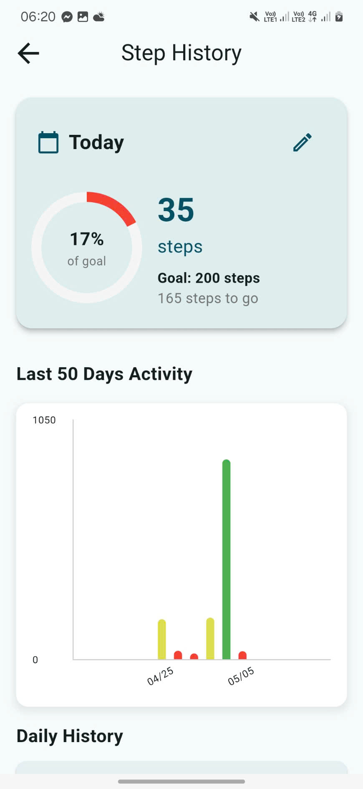

# Health Monitor Xiao BLE App

A Flutter-based mobile application for healthcare monitoring that visualizes IMU sensor data from BLE devices, featuring step tracking, fall detection, and comprehensive health analytics.

## 🚀 Features

### Core Functionality
- **Real-time IMU Data Visualization**: Live display of accelerometer and gyroscope data
- **Step Counting**: Automatic step detection and tracking with customizable daily goals
- **Fall Detection**: Advanced fall detection algorithm with emergency alert system
- **BLE Connectivity**: Seamless Bluetooth Low Energy connection to health monitoring devices
- **Historical Data**: Comprehensive step history with charts and analytics

### User Management
- **Firebase Authentication**: Secure user registration and login
- **User Profiles**: Personal health data management
- **Goal Setting**: Customizable daily step goals

### Safety Features
- **Emergency Alerts**: Automatic emergency notifications on fall detection
- **Alert Escalation**: Configurable alert system with audio/vibration feedback
- **Quick Response**: "I'm OK" button for false alarm cancellation

## 🏗️ Architecture

### Project Structure
```
lib/
├── src/
│   ├── config/
│   │   ├── models/
│   │   │   └── services/
│   │   │       ├── ble_data_service.dart
│   │   │       ├── ble_service.dart
│   │   │       └── fall_alert_service.dart
│   │   └── presentations/
│   │       ├── home_screen/
│   │       ├── ble_screen/
│   │       ├── step_historical_screen/
│   │       └── authentication/
│   └── utils/
packages/
└── user_repository/
    ├── lib/
    │   ├── src/
    │   │   ├── entities/
    │   │   ├── models/
    │   │   └── repositories/
    │   └── user_repository.dart
```

### Key Components

#### BLE Data Service
- Manages real-time IMU data from connected devices
- Handles step counting and fall detection algorithms
- Provides data streams for UI updates

#### User Repository
- Abstracts data persistence layer
- Implements Firebase backend integration
- Manages user authentication and profile data

#### Fall Alert Service
- Monitors for fall detection events
- Handles emergency notification system
- Manages alert escalation and cancellation

## 📱 Screens

<p>




</p>

<!-- Second row: 3 images -->
<p>



</p>
